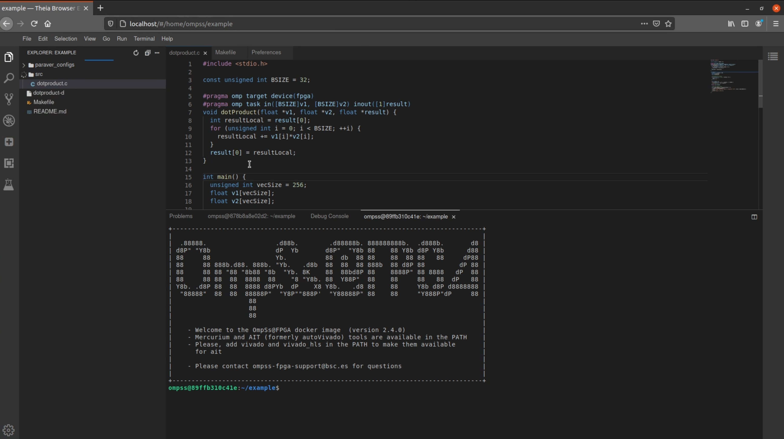

# Eclipse Theia 

[Eclipse Theia](https://theia-ide.org/)  is an extensible platform to develop multi-language Cloud & Desktop IDEs with state-of-the-art web technologies.

This repository creates derived docker-image from the official OmpSs@fpga where Theia IDE is installed and ready-to-develop.

# How to build

To compile the image, you can use:

 ``docker build . -t ompss_fpga_theia`` 
 
This will create an image tagged as ompss_fpga_theia

# How to use

Since in order to use OmpSs@FPGA stack, [Vivado](https://www.xilinx.com/products/design-tools/vivado.html) is needed, you must have vivado installed in your local machine.

Once you have vivado installed, for example, in /tools folder the following command will do the trick:

``docker run -d -p 80:3000 -v /tools:/tools ompss_fpga_theia``

Notice that we used ``-p`` argument in order to map the port 80 of our machine with the 3000 of docker. 

This is because Theia will create a web server located at the port 3000, doing this mapping will forward the web-server to the port 80 of our local machine, in case you have the port 80 occupied, you can change it.

Now, you only have to enter: http://localhost and eclipse theia, using OmpSs@FPGA stack should be loaded.

In addition, the autocompletion plugin is preloaded.

