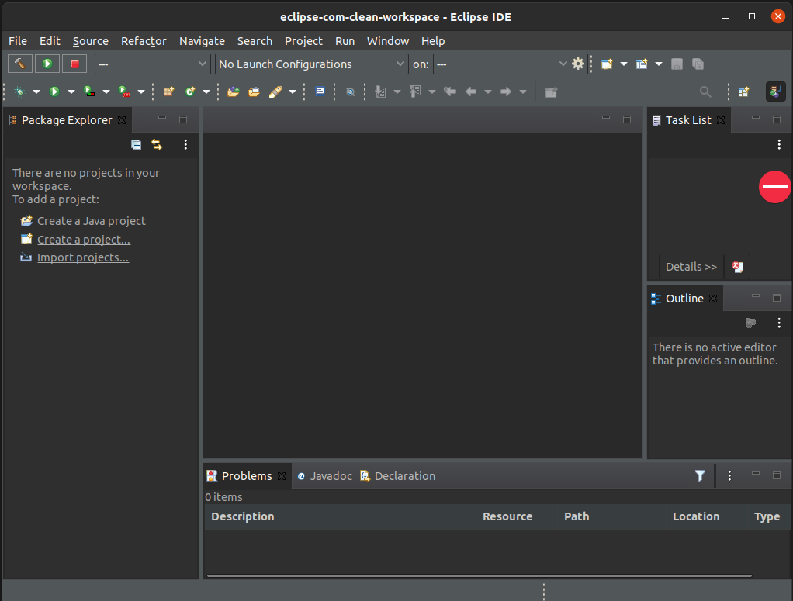
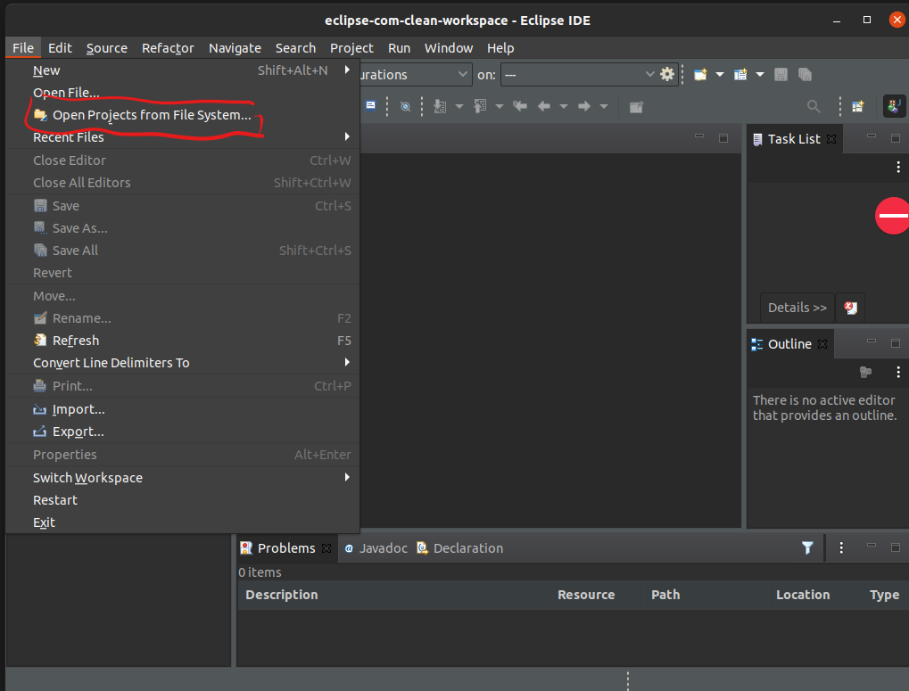
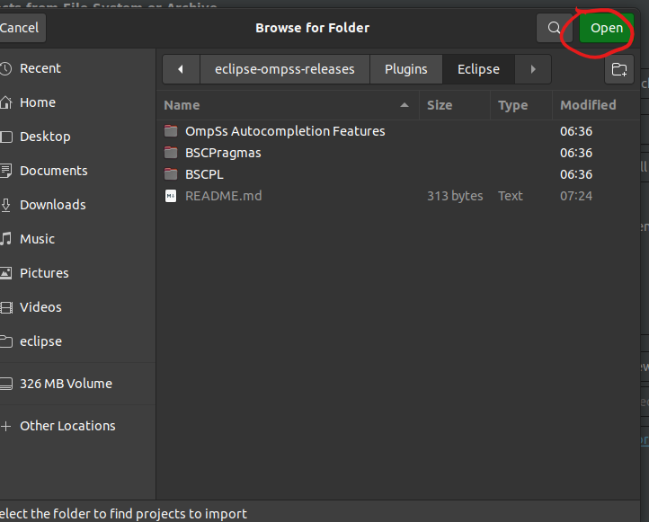
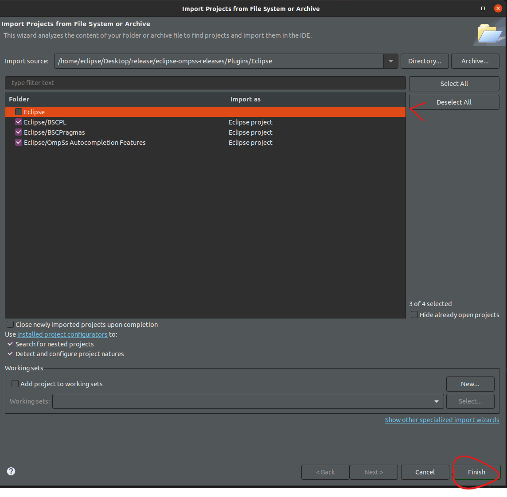
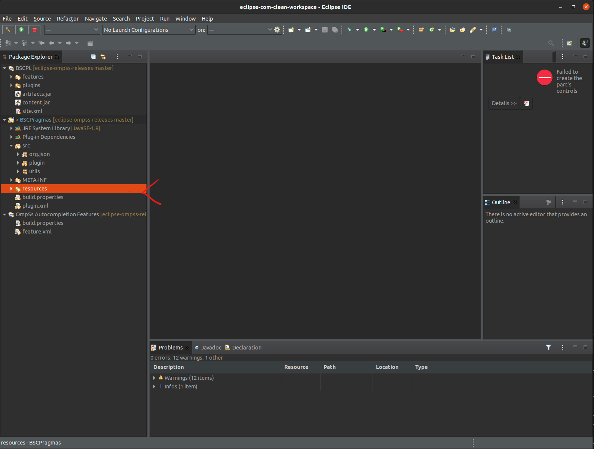
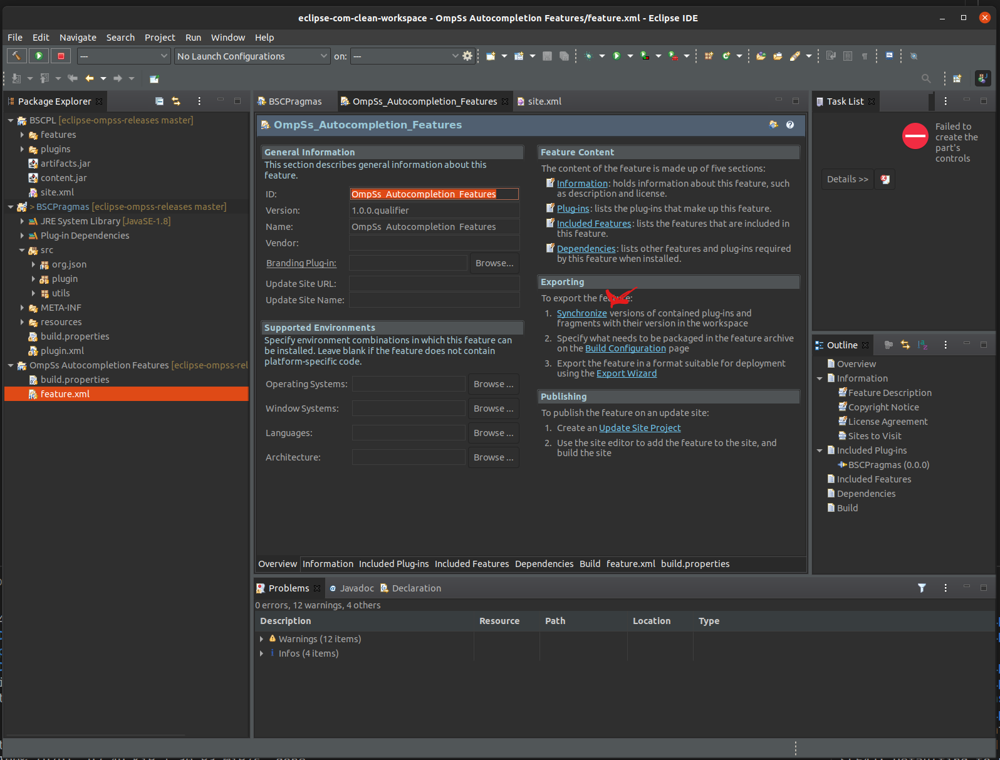
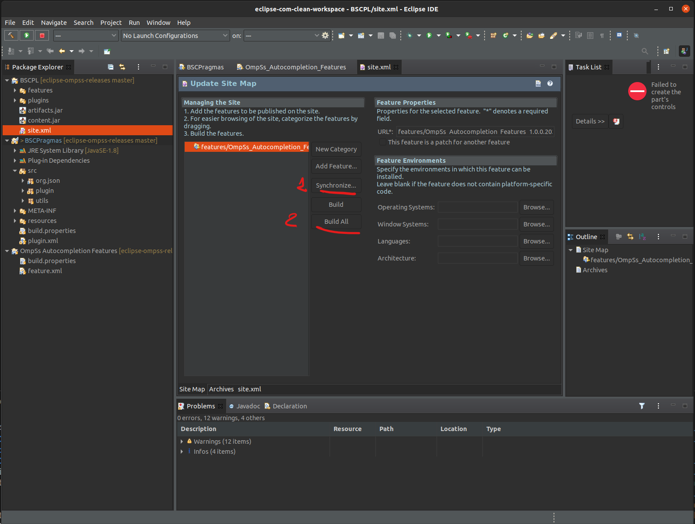
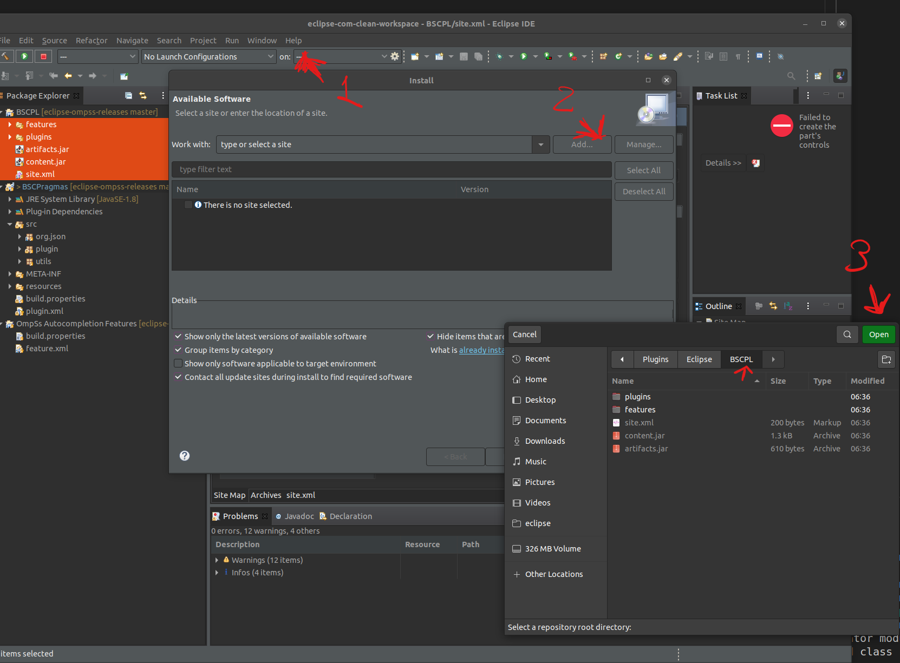

# Eclipse plugin 

This project is divided in three parts.

1. Eclipse Plugin (BSCPragmas)
2. Eclipse Feature Project (OmpSs Autocompletion Features)
3. Eclipse P2 repository (BSCPL)

This is due to the way Eclipse accepts plugins to be installed. For ease of use, these projects must be created using Eclipse, following these instructions:

# Requirements
Eclipse requires a Java JRE or JDK version 8 or newer.
The installation of plugins in Eclipse requires to have the support for
   - Eclipse PDE Plug-in Developer Resources
   - Oomph Setup PDE

You can install them from Eclipse itself using the "Install New Software..."
entry from the "Help" menu.

# Open Eclipse

# Open Projects from FS

# Select the folder with all 3 projects

# Unselect ECLIPSE and finish the configuration

# Check that the resources folder has the tree/tokens.json files

# Synchronize OmpSs Autocompletion Features project with BSCPragmas

Display the file "features.xml" in OmpSs Autocompletion Features, and use
the "synchronize" button to synchronize it with BSCPragmas

# Synchronize and build the repository

# Now, you can open your eclipse installation and install the plugin

To do so, go to help/install-new-software, and add the BSCPL project. 
You can share this BSCPL project and zip it in order to distribute the plugin.

